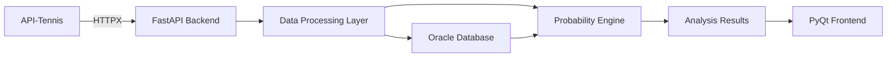
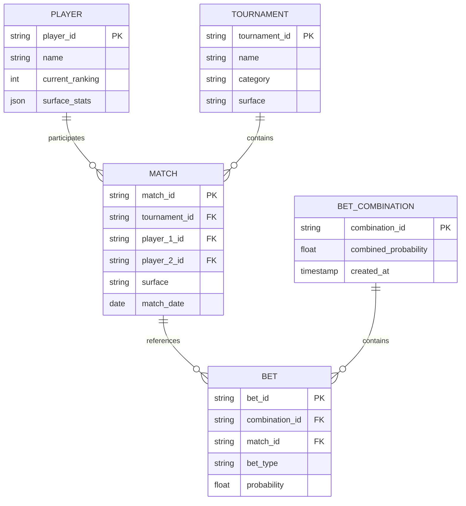

## Overview

OddsEngine's data model is designed to centralize tennis-specific information from multiple sources and structure it for probabilistic analysis. The platform organizes data around three primary entities: **Players**, **Matches**, and **Tournaments**, with additional structures for **Bet Combinations**.

<Info>
  The data architecture is built to support both real-time analysis and historical data persistence for statistical modeling.
</Info>

## Core Entities

### Player Model

The Player entity captures comprehensive information about tennis players from both ATP and WTA tours.

**Key Attributes:**

- **Identity**: Player ID, name, nationality
- **Ranking Data**: Current ATP/WTA ranking, ranking points, career-high ranking
- **Performance Metrics**: Win/loss records, surface-specific statistics, head-to-head records
- **Historical Data**: Tournament results, match history, form indicators

<Note>
  Player data is synchronized with the API-Tennis service, which specializes in tennis-specific data and provides coverage of both ATP and WTA tours.
</Note>

**Example Structure:**

```json
{
  "player_id": "atp_12345",
  "name": "Player Name",
  "nationality": "ESP",
  "current_ranking": 5,
  "ranking_points": 4850,
  "surface_stats": {
    "clay": {"wins": 120, "losses": 35},
    "hard": {"wins": 145, "losses": 48},
    "grass": {"wins": 42, "losses": 18}
  }
}
```

### Match Model

The Match entity represents individual tennis matches with detailed metadata for analysis.

**Key Attributes:**

- **Match Identity**: Unique match ID, tournament reference, round
- **Participants**: Player references (player_1, player_2)
- **Match Details**: Date, time, court surface, match type (best of 3/5)
- **Contextual Data**: Tournament category, round importance, weather conditions
- **Results**: Score, match statistics, duration

<Tip>
  Match context (surface, tournament level, round) significantly impacts probability calculations and is therefore captured comprehensively.
</Tip>

**Example Structure:**

```json
{
  "match_id": "m_2026_aus_open_001",
  "tournament_id": "t_aus_open_2026",
  "date": "2026-01-15",
  "round": "Round of 16",
  "surface": "hard",
  "player_1_id": "atp_12345",
  "player_2_id": "atp_67890",
  "best_of": 5,
  "status": "scheduled"
}
```

### Tournament Model

The Tournament entity organizes matches within competitive structures and provides contextual metadata.

**Key Attributes:**

- **Tournament Identity**: Tournament ID, name, year
- **Classification**: Category (Grand Slam, Masters 1000, ATP 500, etc.)
- **Location Data**: Country, city, venue
- **Tournament Details**: Surface, indoor/outdoor, prize money, ranking points
- **Schedule**: Start date, end date, match schedule

**Tournament Categories:**

| Category | ATP Points (Winner) | WTA Points (Winner) |
|----------|---------------------|---------------------|
| Grand Slam | 2000 | 2000 |
| Masters 1000 / WTA 1000 | 1000 | 1000 |
| ATP 500 / WTA 500 | 500 | 500 |
| ATP 250 / WTA 250 | 250 | 250 |

### Bet Combination Model

Bet combinations represent user-defined selections for probabilistic analysis.

**Key Attributes:**

- **Combination ID**: Unique identifier
- **Individual Bets**: Array of bet selections
- **Bet Details**: Match reference, prediction type, selected outcome
- **Calculated Probability**: Combined probability percentage
- **Timestamp**: Creation and calculation timestamps

<Info>
  The platform calculates combined probabilities by applying probability multiplication rules to independent events, adjusted for correlation factors when applicable.
</Info>

**Example Structure:**

```json
{
  "combination_id": "combo_001",
  "created_at": "2026-03-08T10:30:00Z",
  "bets": [
    {
      "match_id": "m_2026_aus_open_001",
      "bet_type": "match_winner",
      "selection": "player_1",
      "individual_probability": 0.68
    },
    {
      "match_id": "m_2026_aus_open_002",
      "bet_type": "match_winner",
      "selection": "player_2",
      "individual_probability": 0.55
    }
  ],
  "combined_probability": 0.374,
  "combined_probability_percent": "37.4%"
}
```

## Data Flow Architecture



### Data Pipeline

1. **Data Ingestion**: External tennis data is consumed from API-Tennis using asynchronous HTTPX requests
2. **Data Validation**: Incoming data is validated and mapped to internal models
3. **Data Persistence**: Validated data is stored in Oracle Database for historical analysis
4. **Data Processing**: Statistical models process stored data to extract patterns
5. **Data Presentation**: Processed data is served to the frontend for user interaction

## Data Storage Strategy

<Note>
  OddsEngine uses Oracle Database for persistent storage, enabling complex queries and historical analysis required for probability calculations.
</Note>

**Storage Considerations:**

- **Historical Data**: Match results and player statistics are retained for trend analysis
- **Performance Optimization**: Frequently accessed data (current rankings, recent matches) is indexed for fast retrieval
- **Data Freshness**: External data is synchronized on a configurable schedule to balance API limits with data currency

### Fallback Strategy

To handle API failures or rate limiting:

- **Mock Data Provider**: A `mock_data_provider.py` module simulates network responses with local data
- **Graceful Degradation**: The system continues functioning with cached data when external APIs are unavailable
- **Rate Limit Management**: Request throttling ensures the 1,000 requests/month limit is respected

<Tip>
  The mock data provider is particularly useful during development and testing, eliminating dependency on external services.
</Tip>

## Schema Relationships



## Data Quality and Validation

**Validation Rules:**

- Player rankings must be positive integers
- Match dates cannot be in the past for scheduled matches
- Probability values must be between 0 and 1
- Surface types are restricted to valid values (clay, hard, grass, carpet)
- Tournament categories follow official ATP/WTA classifications

<Info>
  Data validation occurs at multiple layers: API response validation, model-level validation, and database constraints.
</Info>

## Next Steps

To understand how this data is used for analysis:

- See [Probability Engine](/concepts/probability-engine) for calculation methods
- See [Tennis Data](/concepts/tennis-data) for tennis-specific data details
