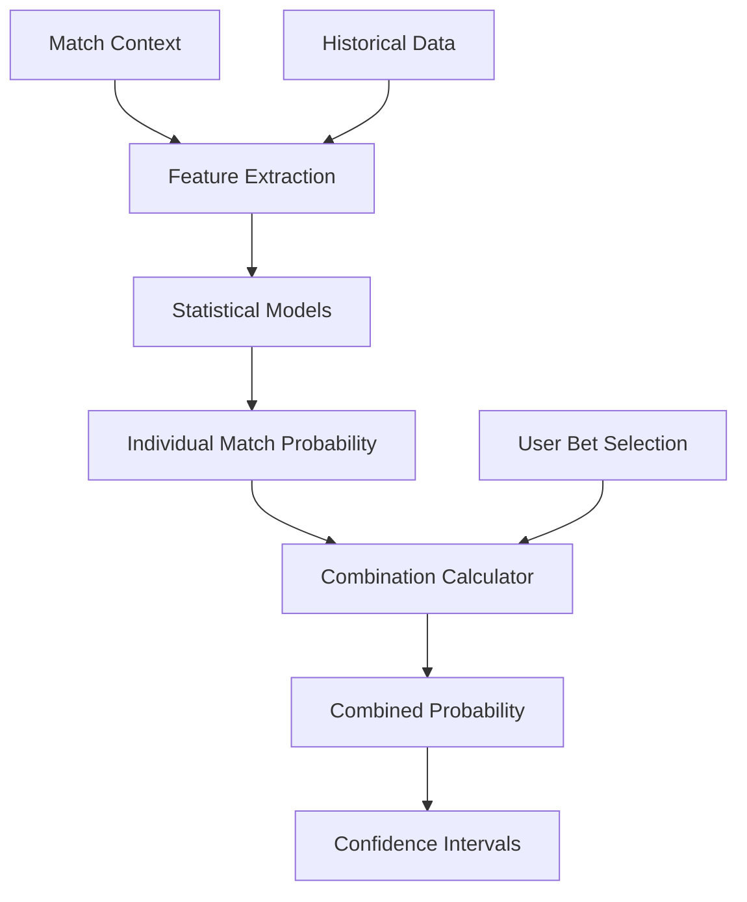

## Overview

The Probability Engine is the core analytical component of OddsEngine. It transforms historical tennis data and current match context into statistical probabilities for match outcomes and bet combinations.

<Note>
  OddsEngine replaces intuition-based betting with data-driven probability calculations, providing transparent statistical foundations for each prediction.
</Note>

## Design Philosophy

**Key Principles:**

1. **Data-Driven**: All probabilities are derived from statistical analysis of historical data
2. **Transparent**: The mathematical foundations are documented and auditable
3. **Context-Aware**: Calculations incorporate match-specific factors (surface, tournament level, etc.)
4. **Conservative**: The engine prefers underestimating confidence over false precision

## Probability Calculation Pipeline



## Individual Match Probability

### Base Probability Model

The engine calculates individual match probabilities using multiple statistical approaches:

#### 1. Elo Rating System

Elo ratings provide a foundation for relative player strength:

```python
# Simplified Elo calculation concept
def expected_score(rating_a, rating_b):
    """
    Calculate expected probability that player A defeats player B
    """
    return 1 / (1 + 10 ** ((rating_b - rating_a) / 400))
```

**Elo Adjustments:**

- Surface-specific Elo ratings (clay, hard, grass)
- Tournament-level adjustments (Grand Slam vs ATP 250)
- Recency weighting (recent matches weighted more heavily)

<Tip>
  Surface-specific Elo ratings are critical in tennis. A player dominant on clay may struggle on grass, so maintaining separate ratings by surface improves accuracy.
</Tip>

#### 2. Head-to-Head Analysis

Direct matchup history provides valuable context:

```python
# Head-to-head probability contribution
def h2h_probability(player_a_id, player_b_id, surface):
    """
    Calculate probability based on historical matchups
    """
    matches = get_h2h_matches(player_a_id, player_b_id, surface)
    if len(matches) < 3:
        return None  # Insufficient data
    
    player_a_wins = sum(1 for m in matches if m.winner == player_a_id)
    return player_a_wins / len(matches)
```

**H2H Considerations:**

- Surface-specific head-to-head records
- Recency of matchups (older matches weighted less)
- Tournament level of previous meetings
- Minimum sample size requirements

#### 3. Recent Form Analysis

Player momentum and current form:

```python
# Recent form metrics
def calculate_form_score(player_id, lookback_days=60):
    """
    Calculate form score based on recent performance
    """
    recent_matches = get_recent_matches(player_id, lookback_days)
    
    # Weight factors
    weights = {
        'win_rate': 0.40,
        'opponent_quality': 0.30,
        'set_dominance': 0.20,
        'tournament_level': 0.10
    }
    
    form_score = calculate_weighted_score(recent_matches, weights)
    return form_score
```

**Form Indicators:**

- Win/loss record in last 10-20 matches
- Quality of opponents faced
- Margin of victory (straight sets vs three sets)
- Tournament performance (reaching finals vs early exits)

### Ensemble Probability

Multiple models are combined using weighted averaging:

```python
# Ensemble approach
def calculate_match_probability(match_context):
    """
    Combine multiple probability estimates
    """
    models = {
        'elo': {'weight': 0.40, 'func': elo_probability},
        'h2h': {'weight': 0.25, 'func': h2h_probability},
        'form': {'weight': 0.20, 'func': form_probability},
        'surface': {'weight': 0.15, 'func': surface_affinity}
    }
    
    probabilities = []
    weights = []
    
    for model_name, config in models.items():
        prob = config['func'](match_context)
        if prob is not None:  # Some models may return None
            probabilities.append(prob)
            weights.append(config['weight'])
    
    # Normalize weights if some models didn't contribute
    total_weight = sum(weights)
    normalized_weights = [w / total_weight for w in weights]
    
    # Calculate weighted average
    final_probability = sum(p * w for p, w in zip(probabilities, normalized_weights))
    
    return final_probability
```

<Info>
  The ensemble approach improves robustness. If one model has insufficient data (e.g., no head-to-head history), other models compensate.
</Info>

## Combined Bet Probability

### Independent Events

For independent match outcomes, combined probability uses multiplication:

```python
def calculate_combined_probability(individual_probabilities):
    """
    Calculate probability that all events occur
    P(A and B and C) = P(A) × P(B) × P(C)
    """
    combined = 1.0
    for prob in individual_probabilities:
        combined *= prob
    return combined
```

**Example:**

```python
# Three-match combination
bets = [
    {'match': 'Match A', 'probability': 0.70},  # 70% chance
    {'match': 'Match B', 'probability': 0.60},  # 60% chance
    {'match': 'Match C', 'probability': 0.55},  # 55% chance
]

combined_prob = 0.70 × 0.60 × 0.55 = 0.231
# Combined probability: 23.1%
```

<Note>
  As more events are added to a combination, the combined probability decreases multiplicatively. A 5-bet combination with 70% individual probabilities has only a 16.8% combined probability.
</Note>

### Correlation Adjustments

When events are correlated, adjustments are applied:

```python
def adjust_for_correlation(probabilities, correlation_matrix):
    """
    Adjust combined probability for correlated events
    """
    base_probability = calculate_combined_probability(probabilities)
    
    # Calculate correlation factor
    correlation_factor = calculate_correlation_impact(correlation_matrix)
    
    # Adjust probability
    adjusted_probability = base_probability * correlation_factor
    
    return adjusted_probability
```

**Correlation Examples:**

- **Positive Correlation**: Two players from the same training camp may both perform well/poorly on a given surface
- **Negative Correlation**: In a tournament bracket, if Player A advances, Player B cannot (they're in same section)

<Tip>
  Correlation analysis is complex and requires substantial data. In the initial implementation, OddsEngine focuses on independent events and flags potentially correlated bets for user awareness.
</Tip>

## Contextual Factors

### Surface Impact

Surface type significantly affects match outcomes:

**Surface-Specific Adjustments:**

| Surface | Characteristics | Impact |
|---------|----------------|--------|
| **Clay** | Slow, high bounce | Favors baseline players, longer rallies |
| **Hard** | Medium pace | Most neutral surface |
| **Grass** | Fast, low bounce | Favors serve-and-volley, shorter points |
| **Carpet** | Fast (rare) | Similar to grass, rarely used |

```python
def apply_surface_adjustment(base_probability, player_id, surface):
    """
    Adjust probability based on player's surface proficiency
    """
    player_stats = get_player_stats(player_id)
    
    # Get player's win rate on this surface vs overall
    surface_win_rate = player_stats['surfaces'][surface]['win_rate']
    overall_win_rate = player_stats['overall_win_rate']
    
    # Calculate surface affinity multiplier
    surface_multiplier = surface_win_rate / overall_win_rate
    
    # Apply bounded adjustment
    adjusted_prob = base_probability * surface_multiplier
    return clamp(adjusted_prob, 0.01, 0.99)
```

### Tournament Level

Tournament importance affects player performance:

```python
tournament_weights = {
    'Grand Slam': 1.15,      # Players elevate performance
    'Masters 1000': 1.08,
    'ATP 500': 1.02,
    'ATP 250': 1.00,
    'Challenger': 0.95
}
```

### Match Round

Player motivation and fatigue vary by round:

- **Early Rounds**: Top players may not be fully engaged
- **Quarterfinals/Semifinals**: Peak intensity
- **Finals**: Maximum pressure, potential fatigue

## Confidence Intervals

Probabilities are reported with confidence intervals:

```python
def calculate_confidence_interval(probability, sample_size, confidence_level=0.95):
    """
    Calculate confidence interval for probability estimate
    """
    # Wilson score interval (better for probabilities near 0 or 1)
    z_score = 1.96  # 95% confidence
    
    # Calculate interval bounds
    denominator = 1 + z_score**2 / sample_size
    
    center = (probability + z_score**2 / (2 * sample_size)) / denominator
    margin = z_score * np.sqrt(probability * (1 - probability) / sample_size + 
                                z_score**2 / (4 * sample_size**2)) / denominator
    
    lower_bound = center - margin
    upper_bound = center + margin
    
    return (lower_bound, upper_bound)
```

<Info>
  Confidence intervals communicate uncertainty. A 65% probability with a [60%, 70%] confidence interval is more reliable than 65% with a [45%, 85%] interval.
</Info>

## Statistical Validation

### Backtesting

Model accuracy is validated against historical results:

```python
def backtest_model(historical_matches, model):
    """
    Validate model predictions against actual outcomes
    """
    predictions = []
    actuals = []
    
    for match in historical_matches:
        # Predict using only data available before the match
        predicted_prob = model.predict(match.pre_match_data)
        actual_outcome = 1 if match.winner == match.player_1 else 0
        
        predictions.append(predicted_prob)
        actuals.append(actual_outcome)
    
    # Calculate metrics
    metrics = {
        'brier_score': calculate_brier_score(predictions, actuals),
        'log_loss': calculate_log_loss(predictions, actuals),
        'calibration': calculate_calibration(predictions, actuals)
    }
    
    return metrics
```

**Validation Metrics:**

- **Brier Score**: Measures accuracy of probabilistic predictions (lower is better, range 0-1)
- **Log Loss**: Penalizes confident wrong predictions
- **Calibration**: When model predicts 70%, does the event occur 70% of the time?

<Tip>
  A well-calibrated model is as important as accuracy. If the model consistently predicts 80% but events occur 60% of the time, it's overconfident.
</Tip>

## Technical Implementation

### Python Libraries

OddsEngine leverages Python's data science ecosystem:

```python
import pandas as pd          # Data manipulation
import numpy as np           # Numerical computations
from scipy import stats      # Statistical functions
from sklearn.linear_model import LogisticRegression
from sklearn.ensemble import RandomForestClassifier
```

### Asynchronous Processing

Probability calculations can be computationally intensive:

```python
import asyncio
import httpx
from fastapi import FastAPI

app = FastAPI()

@app.get("/calculate-combination")
async def calculate_combination(bet_ids: list[str]):
    """
    Calculate combined probability asynchronously
    """
    # Fetch match data asynchronously
    async with httpx.AsyncClient() as client:
        match_data_tasks = [
            fetch_match_data(client, bet_id) for bet_id in bet_ids
        ]
        match_data_list = await asyncio.gather(*match_data_tasks)
    
    # Calculate individual probabilities
    individual_probs = [
        calculate_match_probability(match_data)
        for match_data in match_data_list
    ]
    
    # Calculate combined probability
    combined_prob = calculate_combined_probability(individual_probs)
    
    return {
        'individual_probabilities': individual_probs,
        'combined_probability': combined_prob,
        'combined_probability_percent': f"{combined_prob * 100:.2f}%"
    }
```

<Note>
  FastAPI with asynchronous processing ensures the platform remains responsive even when calculating complex multi-bet combinations.
</Note>

## Limitations and Considerations

### Known Limitations

1. **Data Availability**: Probabilities are only as good as the underlying data
2. **Unpredictable Factors**: Injuries, personal issues, weather cannot always be quantified
3. **Sample Size**: Newer players or rare matchups have less historical data
4. **Model Assumptions**: Independence assumptions may not always hold

### Risk Communication

<Info>
  OddsEngine provides probability estimates, not guarantees. Users should understand that a 70% probability means the event is expected to fail 30% of the time.
</Info>

**Responsible Usage:**

- Probabilities are estimates with inherent uncertainty
- Past performance does not guarantee future results
- The platform is designed for analysis, not as betting advice
- Users should make informed decisions considering multiple factors

## Future Enhancements

**Planned Improvements:**

- Machine learning models (gradient boosting, neural networks)
- Real-time odds comparison
- Live match probability updates
- Advanced correlation detection
- Player-specific model customization

## Next Steps

To understand the data used in these calculations:

- See [Data Model](/concepts/data-model) for data structures
- See [Tennis Data](/concepts/tennis-data) for tennis-specific metrics
